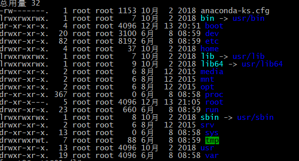

###课前规划介绍
+ JavaSE ★★★★★
+ Linux ★★★★
+ Hadoop生态 HDFS/MAPREDUCE/HIVE/HBASE/ZOOKEEPER/FLUME.. ★★★★★★
+ Flink ★★
+ Spark ★★★★★

### Linux
+ ★ 分类
> * 市场方向
> > 1. 图形界面版：注重用户体验，目前还不够成熟，代表作ubuntu
> > 2. 服务器版：注重性能，代表 centOs(免费)、RedHat(收费)
> * 原生程度
> > 1. 内核版本：在Linus领导下的小组开发的维护版本
> > 2. 发行版本：一些组织或公司在内核版本的基础上进行二次开发之后重新发行的版本

+ ★ 安装
> 通过虚拟机VMware软件进行安装，安装教程请谷歌

+ ★ 目录结构

    
> + bin: 存放二进制可执行文件
> + sbin: 存放二进制可执行文件，**只有root用户可访问**
> + ★ etc: 存放系统配置文件，例如 环境变量
> + ★ usr：用户存放共享的系统资源
> + ★ home: 存放用户文件的根目录
> + dev: 用户存放设备文件，例如 U盘 USB
> + mnt: 系统管理员安装零食系统的管理点，例如 挂载镜像、挂载光盘
> + boot: 存放系统应道时的系统文件，不能删除，删除系统只能重装，开启系统时会加载该文件
> + tmp: 用户存放各种临时文件，可删除
> + var: 用户存放运行时需要改变的数据文件

+ ★ 远程连接工具注意事项
> + 需要关闭防火墙
> > 1. 查看防火墙 firewall-cmd --state
> > 1. 关闭防火墙 systemctl stop firewalld
> > 1. 禁止启动防火墙 systemctl disable firewalld

+ ★★★ 常用命令 
> + 文件目录操作
> > + 创建：mkdir 目录名称/文件名 mkdir -p 可以创建多级目录
> > + 查看：ls ll ls -a(查看影藏文件/文件夹)
> > + 修改：mv 老目录名/ 新目录名/
> > + 删除：
> > > + 文件：rm 文件名(有提示) rm -f 文件名(强制删除)
> > > + 目录：rm -r 目录名(有提示) rm -rf(强制删除，递归删除，包括文件)
> > + 拷贝：
> > > + cp 文件名 目录名 拷贝文件
> > > + cp -r src dst 拷贝文件夹，递归拷贝，包括文件
> + 文件操作
> > + 创建：touch 文件名
> > + 查看：
> > > + cat 文件名 -- 一次全部显示
> > > + more 文件名 -- 显示当前已显示内容所占内容的百分比功能，回车下一行，空格翻页，q键退出
> > > + less 文件名 -- Page Up 和Page Down进行翻页
> > > + tail 文件名 --tail -行数(查看文件后的多少行) tail -f 文件名 监控文件，针对动态变化的文件
> > + 修改：vi 文件名。i 插入 esc 退出编辑模式 输入:wq! 强制保存退出 :q强制不保存退出
> > + 删除：rm -rf
> + 压缩解压
> > + 解压：tar -zxvf 压缩包路径包括名称
> > > + z：调用gzip的格式解压
> > > + x：解压文件
> > > + v：显示运行过程
> > > + f：指定文件名
> > + 压缩：tar -zcvf 压缩包路径包括名称 需要压缩的文件或文件夹(可多个，中间空格隔开)
> > > + ``tar -zcvf test.tar.gz dir1,dir2,file1``
> > > + 批量压缩：tar -zcvf 压缩文件名 s*(支持通配符)

> + 其他
> > + 显示当前路径：pwd
> > + 搜索名称
> > > + find 目录 -name "文件名" 如 find / -name "test"
> > > + whereis 程序名，搜索程序所在的目录
> > > + which 程序名，搜索程序所在目录
> > + 进程查看
> > > + ps -f：查看所有进程
> > > + ps -ef | grep 进程名：查看进程的详细信息
> > > > 注：| 管道符，表示上一条命令的输出是下一条名称的输入
> > + 软件包管理器(需要联网操作)
> > > + yum search 软件名称：查询软件
> > > + yum install 软件名称(建议是上一条输出的软件名)：安装软件
> > + 用户操作
> > > + 添加用户：useradd 用户名 -> passwd 用户名 密码
> > > + 切换用户：su 用户名，exit 退出上一个用户
> > > + 用户权限：cd /etc vi sudoers,按照格式(root ALL=(ALL) ALL)加上即可
> > > + 查看用户：cat /etc/passwd

