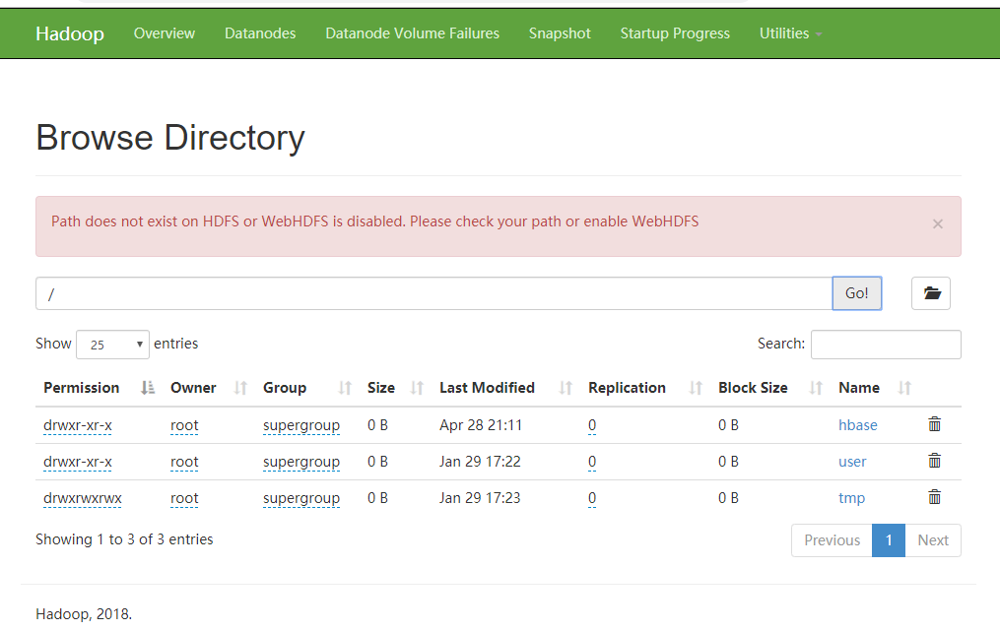
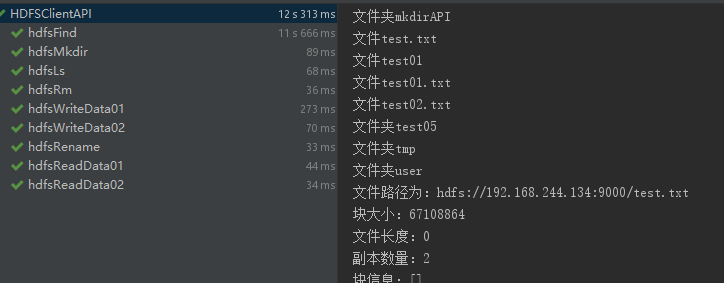

### HDFS客户端操作方式介绍
+ 网页形式(测试使用)如图<br/>

+ 命令行模式(测试、调试使用) <br/>              

+ 企业级API(开发使用)
```
public class hadhoopDemo02 {

    public static void main(String[] args) {
        // TODO Auto-generated method stub
        // 1、客户端加载配置文件
        Configuration conf = new Configuration();
        // 2、指定配置(設置2個副本數)
        conf.set("dfs.replication", "2");
        // 3、指定塊大小
        conf.set("dfs.blocksize", "64m");

        try {
            // 4、構造客戶端
            FileSystem fs = FileSystem.get(new URI("hdfs://192.168.244.129:9000"), conf, "root");
            // 5、上傳文件
            fs.copyFromLocalFile(new Path("E:\\words.txt"), new Path("/"));
            fs.close();
        } catch (IOException e) {
            e.printStackTrace();
        } catch (InterruptedException e) {
            e.printStackTrace();
        } catch (URISyntaxException e) {
            e.printStackTrace();
        }
    }
}
```
### ★★★ HDFS常用命令(客户端)
+ hdfs dfs -help:查看帮助
+ hdfs dfs -ls 目录：查看当前目录信息
+ hdfs dfs -put 本地路径 HDFS文件：从本地复制文件到HDFS
> - 例如：hdfs dfs -put test.txt /test.txt
+ hdfs dfs -moveFromLocal 本地路径 HDFS文件：从本地目录剪切文件到HDFS路径
> - 例如：hdfs dfs -moveFromLocal test.txt /test.txt
+ hdfs dfs -get HDFS路径 文件名：下载文件
> - 例如：hdfs dfs -get /test test.txt
+ hdfs dfs -getmerge HDFS路径 文件名：下载HDFS某个目录所有文件并合并成一个文件并保存到本地
> - 例如：hdfs dfs -getmerge / /merge.txt
+ hdfs dfs -mv HDFS文件 HDFS目录：移动文件到指定目录
> - 例如：hdfs dfs -mv test.txt /test01
+ hdfs dfs -mkdir HDFS目录：创建单级文件目录 加上-p可以创建多级
> - 例如：hdfs dfs -mkdir /newpath；hdfs dfs -mkdir -p /newpath01/newpath02
+ hdfs dfs -cp 文件 目录:复制文件
> - 例如：hdfs dfs -cp test /testcp
+ hdfs dfs -rm 文件：删除文件，加-r可删除目录
> - 例如：hdfs dfs rm /test01
+ hdfs dfs -cat 文件：查看文件内容
> - 例如：hdfs dfs cat /test
+ hdfs dfs -cat 文件 | tail -N：查看文件内容的最后N行
> - 例如：hdfs dfs -cat /test | tail -2
+ hdfs dfs -count 目录：查看目录中有多少文件
> - 显示顺序是(左到右)文件夹数量、文件数量、文件大小<br/>

+ hdfs dfs -df 目录：查看空间大小 加上-h按照G进行统计<br/>

+ hdfs dfs -setrep 1 文件 设置文件副本数，重启后也生效
> - 例如：hdfs dfs -setrep 2 /test
### ★★★ 企业级别API
+ 环境配置(Windos环境)
> + 安装JAVA
> + 配置JAVA环境变量
> > + 新增JAVA_HOME  C:\Program Files\Java\jdk1.8.0_31；
> > + PATH添加:C:\Program Files\Java\jdk1.8.0_31\bin  C:\Program Files\Java\jdk1.8.0_31\jre\bin
> + 把下载好的Hadoop-2.8.5解压到相应路径
> + 配置Hadoop环境变量
> > + 增加HADOOP_HOME   E:\hadoop-2.8.5
> > + PATH添加 E:\hadoop-2.8.5\bin  E:\hadoop-2.8.5\sbin
> + [重要:下载并添加编译的winutils包和hadoop.dll，放到目录E:\hadoop-2.8.5\bin下](软件)
+ [常用企业级API代码](HadoopAPI/src/main/java/HDFSClientAPI.java)
+ 测试结果：<br/>

