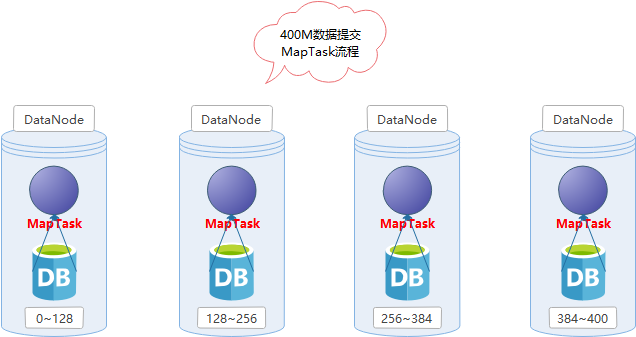

### MapTask并行度与决定机制

1. 一个job任务的Map阶段并行度由**客户端提交的任务决定的**
2. 将待处理的数据执行逻辑切片(按照特定的到校分成多个split，默认128M)每个split分配一个MapTask并行处理
3. 默认情况下split大小=blockSize，分派决定mapTask进程数量
4. 切片是针对每一个文件单独切片
### MapTask工作机制

1. MapTask_0 负责split_0(128M)，MapTask_1负责split_1(82M)
2. MapTask_0 通过一个组件TextInputFormat读取split_0，这个组件封装一个LineRecordReader，里面有next方法，没调用一次方法就从
split_0中读取一行，给MapTask行起始offset和行内容。
3. 调用Mapper练的map(k,v,context)方法，再返回context.write(k,v)
4. MapTask收到k,v,再调用MapTask里的工具类，调用outputColletor.collect()序列化，变成二进制，放到一个环形缓冲区
5. 不断的向缓冲区放输出的数据，环形缓冲区默认100M，当放入的容量达到80%，把数据溢出的通过调用splier.spill()，在过程中先分区
排序，同一个区内的按照key排序，得到分区，根据这个分区文件写入到磁盘中(算法采用的快排)
6. 当缓冲结束，读取切片完成，会把溢出的文件合并，对局部数据通过归并排序(外部排序法)
### MapTask优化点
- 预处理：准备数据的时候进行预处理，将小文件合并成大文件(针对处理的文件多数为小文件情况)
> - 方案：使用CombineTextInputFormat可以把多个小文件处理成一个文件，如下<br/>
```
    job.setOutputKeyClass(Text.class);
    job.setOutputValueClass(FlowBean.class);
    
    // 指定运行的inputformat方式，默认的方式是textinputformat(大小文件优化)
    **job.setInputFormatClass(CombineTextInputFormat.class);
    CombineTextInputFormat.setMaxInputSplitSize(job, 4194304); //设置最大4M
    CombineTextInputFormat.setMinInputSplitSize(job, 3145728); //设置最小3M**
    
    // 设置输入和输出路径
    FileInputFormat.setInputPaths(job, new Path("/wc/flowin"));
    FileOutputFormat.setOutputPath(job, new Path("/wc/flowout"))
```
 
