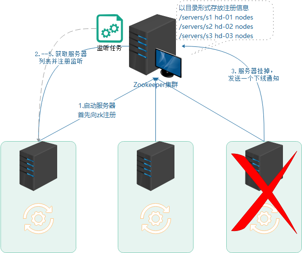
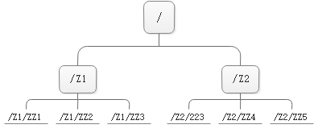
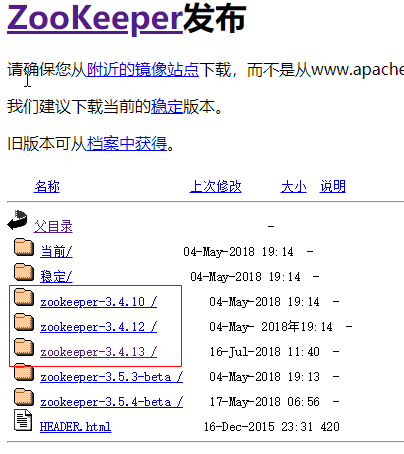
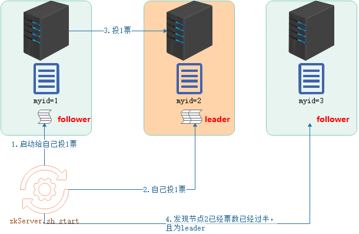
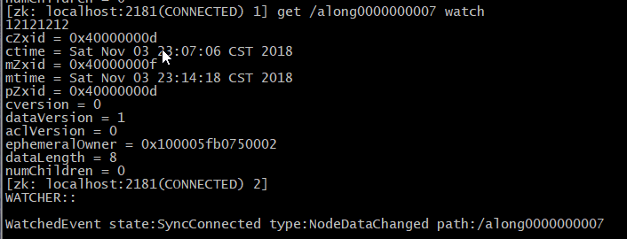
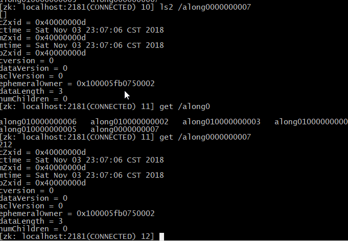

### 介绍
简介：Apache Zookeeper致力于开发和未付开源服务器，实现高可用的**分布式协调**        
用途：Zookeeper是一种集中式服务，用于维护**配置信息、命名，提供分布式同步和组服务**        
功能：
+ 数据存储(针对元数据)
+ 监听(主要功能)
### 工作机制
+ 基于观察者模式设计的分布式服务管理框架
+ 文件系统：存储数据
+ 通知机制：监听       

### 数据存储结构
+ 默认存储1M的数据
+ 存储格式为目录树结构        

### 使用场景
+ 集群统一的配置管理
+ 集群统一的命名服务
+ 集群统一管理
+ 服务器的动态上下线感知
+ 负载均衡
### 集群搭建
1. 下载：http://mirror.bit.edu.cn/apache/zookeeper     

2. [安装JDK并配置环境变量](../Day03Hadoop集群安装部署/README.md#准备工作)
3. 上传到集群任意节点(ALT+P)
4. 解压到指定目录。例如：tar -zxvf zookeeper-3.4.13.tar.gz -C hd/
5. 修改配置文件：zoo_sample.cfg    

    1. 所在路径：zookeeper-3.4.13/conf
    1. 重命名：mv zoo_sample.cfg zoo.cfg
    1. 修改数据的存储路径dataDir(默认是dataDir=/tmp/zookeeper),可修改为自定义路径，例如dataDir=/root/hd/zookeeper-3.4.13/zkData     
         
6. 修改zoo.cfg配置文件增加如下配置(路径：zookeeper-3.4.13/conf)        
说明：HD09-01 是指我们配置的节点的主机名称，不明白怎么配置的可以查看。[配置主机名称](../Day03Hadoop集群安装部署/README.md#准备工作)    
server.1=HD09-01:2888:3888      
server.2=HD09-02:2888:3888      
server.3=HD09-03:2888:3888      
7. 新建文件myid：touch zkData/myid，并且写入服务器id，例如1     

8. 发送到其他节点：scp -r zookeeper-3.4.13/ HD09-02:$PWD
9. 修改每个节点的myid值，依次为2,3      

10. 增加环境变量(方便全局执行zk命令)      
export JAVA_HOME=/root/hd/jdk1.8.0_144      
export HADOOP_HOME=/root/hd/hadoop-2.8.5        
export ZOOKEEPER_HOME=/root/hd/zookeeper-3.4.12     
export PATH=$PATH:$JAVA_HOME/bin:$HADOOP_HOME/bin:$HADOOP_HOME/sbin:$ZOOKEEPER_HOME/bin     
11. 发送环境变量到其他节点：scp -r profile HD09-02:$PWD
12. 所有节点加载环境变量(加载后环境变量才会生效)：source /etc/profile     

13. 所有节点启动服务(每个节点都需要执行)：zkServer.sh start
14. 查看状态：zkServer.sh status     

15. 其他常用命令：
    1. 停止服务(所有节点都需要执行):zkServer.sh stop
    2. 进入cli界面：zkCli.sh
### Leader选取机制
1. **Zookeeper集群只能为奇数节点个数**
2. **只要有半数以上的节点存活，就能正常工作**，因此解释为什么需要配置奇数台
3. 选取机制：**节点启动，会给自己投一票，然后给其他存活的通信，让其他的节点给自己投票，新节点启动若发现已经有一个节点的票数超过
半数，则票数过半的为Leader**
4. **Leader宕机，则重写按照顺序选取**       

### 客户端常用命令
1. 启动客户端：zkCli.sh
2. 查看帮助：help
3. 查看当前节点所包含的内容：ls path [watch]     
-watch：子节点的监听，监听当前路径的变动     

4. 创建节点：create [-s] [-e] path data acl
    1. 创建普通节点：create /along 12232
    2. -e 创建临时节点，quit后会消失
    3. -s 创建带序号的节点，如图       
    
    4. -e -s 创建带序号的临时节点，quit会消失     
    
5. 查看节点内容：get path [watch]      
    1. 说明：watch 为监听子节点的变化      
    
    2. 节点字段含义(了解)   
    cZxid = 0x400000013 节点创建的Zxid   
    ctime = Sat Nov 03 23:17:50 CST 2018   节点创建时间   
    mZxid = 0x400000013 节点最后更新的Zxid 
    mtime = Sat Nov 03 23:17:50 CST 2018    节点最后修改时间    
    pZxid = 0x400000013  节点最后更新子节点Zxid  
    cversion = 0     子节点的版本号，子节点的修改次数   
    dataVersion = 0   数据的版本号，数据的修改次数    
    aclVersion = 0   访问控制列表的版本号，    
    ephemeralOwner = 0x0   如果创建的是临时节点，是节点的session id    
    dataLength = 3  数据长度    
    numChildren = 0 子节点数量   
6. 查看节点的详细信息：ls2 path   

7. 修改节点数据：set path data [version]   

8. 删除节点，不能删除非空节点：delete path [version]
9. 递归删除(包括文件)：rmr path      

10. 查看节点的状态信息：stat path [watch]
### 常用API
[完整代码](ZookeeperDemo/src/main/java/ZookeeperCli/zkCliApi.java)      
```java
 @Test
  public void createZnode() throws KeeperException, InterruptedException {
    String path = zkCli.create("/along005", "chihuoguo".getBytes(), Ids.OPEN_ACL_UNSAFE, CreateMode.PERSISTENT);
    String path01 = zkCli.create("/along006", "chihuoguole".getBytes(), Ids.OPEN_ACL_UNSAFE, CreateMode.PERSISTENT);

    System.out.println(path);
    System.out.println(path01);
  }

  /**
   * 获取子节点
   * @throws KeeperException
   * @throws InterruptedException
   */
  @Test
  public void getChild() throws KeeperException, InterruptedException {
    List<String> children = zkCli.getChildren("/", true);

    for(String chil:children) {
      System.out.println(chil);
    }
    Thread.sleep(Long.MAX_VALUE);
  }

  /**
   * 删除节点
   * @throws KeeperException
   * @throws InterruptedException
   */
  @Test
  public void rmChildDate() throws KeeperException, InterruptedException {
    zkCli.delete("/along006", -1);
  }
  /**
   * 修改数据
   * @throws KeeperException
   * @throws InterruptedException
   */
  @Test
  public void setData() throws KeeperException, InterruptedException {
    zkCli.setData("/along005", "quchegnduchihuoguo".getBytes(), -1);
    byte[] data = zkCli.getData("/along005", true, null);
    System.out.println(Arrays.toString(data));
  }
  /**
   * 判断节点是否存在
   * @throws KeeperException
   * @throws InterruptedException
   */
  @Test
  public void testExist() throws KeeperException, InterruptedException {
    Stat exists = zkCli.exists("/along005", false);
    System.out.println(exists == null ? "not exists":"exist");
  }
```
