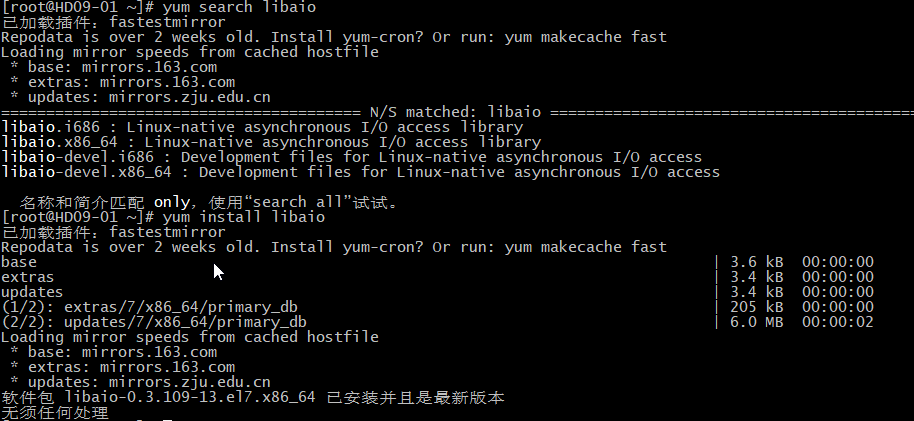

### 安装
1. 下载上传：官网(http://hive.apache.org/)ALT+P：上传到节点      

2. 解压：tar -zxvf apache-hive-1.2.2-bin.tar.gz -C /root/hd
3. [可选]修改hive文件夹名称 ：mv /root/hd/apache-hive-1.2.2-bin/ /root/hd/hive/
4. 修改配置文件hive-env.sh
    1. 更改配置文件名称：mv hd/hive/conf/hive-env.sh.template /root/hd/hive/conf/hive-env.sh
    2. 配置hadoop路径：    
    HADOOP_HOME=/root/hd/hadoop-2.8.5
    3. 配置hive配置文件路径：    
    export HIVE_CONF_DIR=/root/hd/hive/conf
5. 启动hdfs：start-dfs.sh
6. 启动yarn：start-yarn.sh     

7. hdfs创建目录：hdfs dfs -mkdir /tmp; hdfs dfs -mkdir -p /user/hive/warehouse
8. 修改权限：hdfs dfs -chmod 777 /tmp；hdfs dfs -chmod 777 /user/hive/warehouse
9. 启动hive：bin/hive
10. 测试hive是否安装成功：
    1. 查看数据库：show databases;
    2. 使用数据库：use default;
    3.  查看表：show tables;
    4. 创建表：create table itstar(id int，name string);
### 替换数据库为mysql
+ 原因：Hive默认**deploy数据库不支持多客户端操作**，严重缺陷，因此安装mysql来替代deploy
##### 安装MySql：
1. 检查是否有安装mysql：yum list installed | grep mysql     

2. 如果有则删除：yum -y remove 数据库名称
3. 安装依赖：yum search libaio；yum install libaio        

4. 安装wget(不存在情况)：yum install wget       

5. 下载 MySQL Yum Repository：wget http://repo.mysql.com/mysql-community-release-el7-5.noarch.rpm
6. 安装 MySQL Yum Repository：rpm -ivh mysql-community-release-el7-5.noarch.rpm 或 yum localinstall mysql-community-release-el7-5.noarch.rpm
7. 验证 MySQL Yum Repository是否安装成功：yum repolist enabled | grep "mysql.\*-community.\*"      

8. (可选)查看MySql版本：yum repolist all | grep mysql
9. (可选)查看当前可用的Mysql版本：yum repolist enabled | grep mysql
10. 安装MySql：yum install mysql-community-server
    1. 安装完成包括，mysql-community-server、mysql-community-client、mysql-community-common、mysql-community-libs 四个包
    2. 查看mysql目录：whereis mysql
11. 启动mysql：systemctl start mysqld
    1. 查看状态：systemctl status mysqld
    2. 查看版本：mysqladmin --version
12. mysq修改密码：
    1. 切换数据库：use mysql
    2. 修改密码：update user set password=password('新密码') where user='要更新密码的用户名'
    3. 刷新权限：flush privileges
    4. 重启服务：service mysqld restart
13. (需远程连接情况)远程访问 MySQL， 需开放默认端口号 3306：
    1. firewall-cmd --permanent --zone=public --add-port=3306/tcp
    2. firewall-cmd --permanent --zone=public --add-port=3306/tcp
    3. firewall-cmd --reload
14. (需外部连接情况)关闭防火墙
    1. firewall-cmd --state  --查看防火墙状态
    2. systemctl stop firewalld -- 关闭防火墙
    3. systemctl disable firewalld -- 禁止启动防火墙
##### 配置Hive数据库
1. 配置驱动：
    1. 下载：wget http://dev.mysql.com/get/Downloads/Connector-J/mysql-connector-java-5.1.39.tar.gz
    2. 解压：tar -zxvf mysql-connector-java-5.1.39.tar.gz
    3. 拷贝：cp /root/mysql-connector-java-5.1.39/mysql-connector-java-5.1.39-bin.jar /root/hd/hive/lib/
2. 配置配置文件：
    1. 新建配置文件：touch /root/hd/hive/conf/hive-site.xml
    2. 修改配置文件：vi /root/hd/hive/conf/hive-site.xml,增加内容并修改，自行修改主机名称、mysql账号密码 
    ```xml
    <?xml version="1.0"?>
    <?xml-stylesheet type="text/xsl" href="configuration.xsl"?>
    <configuration>
       <property>
           <name>javax.jdo.option.ConnectionURL</name>
               <value>jdbc:mysql://Hadoop01:3306/metastore?createDatabaseIfNotExist=true</value>
               <description>设置元数据库存放地址</description>
       </property>
       <property>
           <name>javax.jdo.option.ConnectionDriverName</name>
           <value>com.mysql.jdbc.Driver</value>
           <description>指定JDBC驱动</description>
       </property>
        <property>
            <name>javax.jdo.option.ConnectionUserName</name>
           <value>root</value>
           <description>mysql账号</description>
       </property>
       <property>
            <name>javax.jdo.option.ConnectionPassword</name>
           <value>root</value>
           <description>mysql密码</description>
       </property>
    </configuration>
    ```
3. **若已经启动hive，需要重启hive，bin/hive**
### 数据类型
|Java数据类型|Hive数据类型|长度|类型名称|
|---|---|---|---|
|byte|TINYTNT|1字节|-|
|short|SMALTNT|2字节|小整型|
|int|INT|4字节|整型|
|long|BIGINT|8字节|长整型|
|float|FLOAT|4字节|单精度浮点数|
|double|DOUBLE|8字节|双精度浮点数|
|string|STRING|2字节|字符类型|
|-|TIMESTAMP|2字节|时间类型|
|-|BINARY|-|字节数组|

### DDL(数据库定义语言)
+ 创建数据库
1. 标准：create database if not exists *table_name*;
2. 创建到hdfs指定路径：create database *table_name* location *'hdfs_path'*;
+ 修改数据库
1. 查询数据库结构：desc database *table_name*;
2. 添加描述信息：alter database *table_name* dbproperties('描述信息');
3. 查看拓展信息：desc database extended *table_name*;
+ 查询数据库：
1. 显示数据库：show database；
2. 筛选数据库：show database like 'db*';
+ 删除数据库：drop database if exists *table_name*;
+ 创建表：create table *table_name(column_name column_type)* row format delimited fields terminated by "\t";
+ 管理表(内部表)：
1. 不擅长做数据共享，删除hive中的管理表，数据也同时会删除，hive上面只是表，hdfs上面存储数据
2. 有数据计算、数据传输的情况会走MR程序，例如计算有多少行、查询数据放入新表等
3. 加载数据：load data local inpath *'file_path'* into table *table_name*;
4. 查询的数据插入新表：create table if not exits *new_table_name* as select * from *old_table_name* where column_name='value';
5. 查询表结构：desc formatted *table_name*;
+ 管理表(外部表)：
1. Hive不认为这张表拥有这份数据，删除该表，数据不删除，擅长做数据共享
2. 创建：create external table if not exists *table_name(column_name column_type)* row format delimited fields terminated by "\t";
3. 删除后重新创建管理表 create table if not exists *table_name(column_name column_type)* row format delimited fields terminated by "\t"; (数据会自动关联)
+ 创建分区表：
create table *table_name(column_name column_type)* partitioned by (day string) row format delimited fields terminated by '\t';    
**注：按照时间分区 day string**     

+ 导入数据：load data local inpath *'file_path'* into table *table_name* partition(day=*day_value*);      

+ 单分区查询：select * from *table_name* where day=*day_value*;   
**注：不加条件会查询所有的分区数据**    

+ 添加分区：alter table table_name add partition(day=*day_value*)；
+ 表结构查询：desc formatted table_name;      

+ 删除指定分区表：alter table *table_name* drop partition(day=*day_value*),partition(day=*day_value*);
+ 修改表名：alter table *table_name* rename to *new_table_name*;
+ 添加列：alter table *table_name* add columns (*new_column string*);       

+ 更新列类型：alter table *table_name* change column *old_column new_column int*;
+ 替换列：alter table *table_name* replace columns(*column_name_new column_type_new*);      
**注：相当于重定义，原来的数据也会丢失**
### DML(数据操控语言)
+ 本地加载数据：load data local inpath *'file_path'* into table *table_name*;
+ 加载HDFS数据：load data inpath *'hdfs_path'* into table *database_name.table_name*;      
注：相当于剪切，把数据剪切到hdfs目录去了
+ 数据覆盖：loda data local inpath *'file_path'* overwrite into table *table_name*;
+ 向分区表插入数据：insert into table *table_name* partition(*month='201811'*) values (*value，value*);
+ 按条件查询后放入新表：create table if not exists *table_name_new* as select * from *table_name* where *column_name = value*;
+ 创建表的时候导入数据：create table *table_name(column_name column_type)* row format delimited fields terminated by '\t' location *'hdfs_file_path'*;
+ 数据导出：insert overwrite local directory *'local_file_path'* select * from *table_name* where *column_name = value*;     

+ 数据导出(hive shell方式)：bin/hive -e "select * from *table_name*" > *local_file_name*     加where需要外面双引号，里面单引号       

+ 数据导出(hadoop方式)：dfs -get *hdfs_file_path* *local_file_path*
+ 清空表格：truncate table *table_name*;

