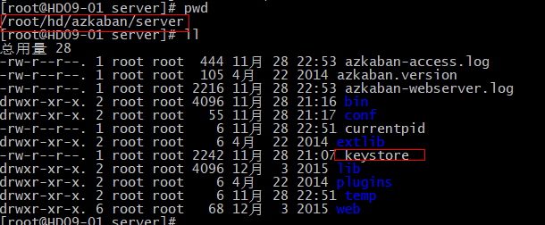
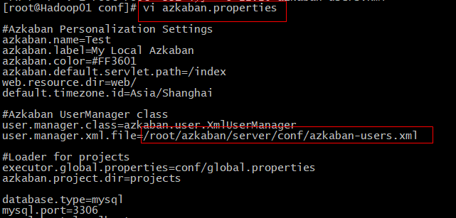
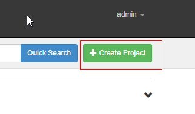
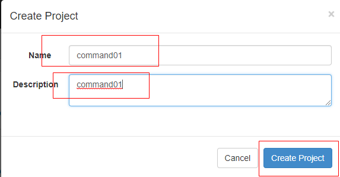

### 概述
+ 官网：https://azkaban.github.io/
+ 简介：Azkaban是一个分布式工作流管理器，在LinkedIn上实现，以解决Hadoop作业依赖性问题。我们有需要按顺序运行的工作，
从ETL工作到数据分析产品。
+ 工作流程：     

+ 特点
	1. 给用户提供了一个非常优化的可视化界面-web界面；
	2. 非常方便的上传工作流；
	3. 设置任务间的关系；
	4. 权限设置；
	5. 模块化；
	6. 随时停止和启动任务；
	7. 可以查看日志记录；
### 对比Oozie
+ Azkaban是一个轻量级调度工具；
+ 企业应用的功能并非小众的功能可以使用Azkaban；
1. 功能方面
    1. 两个任务调度器可以调度使用MR、Java、脚本工作流任务；
    1. 都可以进行定时调度
2. 使用方面： Azkaban支持直接传参；Oozie不仅支持传参，还支持EL表达式；
3. 定时任务：Azkaban定时执行任务基于时间;Oozie任务基于时间和数据；
4. 资源方面：
    4. Azkaban有严格的权限控制
    4. Oozie五严格的权限控制
### 安装部署
#####  准备工作
	1. 下载上传安装包  本地
	目录：E:\downloadFile\azkaban    
    azkaban-executor-server-2.5.0.tar.gz(执行服务器)     
    azkaban-web-server-2.5.0.tar.gz(管理服务器)      
    azkaban-sql-script-2.5.0.tar.gz（mysql脚本）        
	1. 修改名称 mv azkaban-web-2.5.0/ server  mv azkaban-executor-2.5.0/ executor
	2. 以上包全部解压解压重命名：tar-zxvf mv 
	3. mysql中创建一个数据库：create database azkaban;
	4. 使用azkaban数据库：use azkaban
	5. 导入SQL脚本：source /root/hd/azkaban/azkaban-2.5.0/create-all-sql-2.5.0.sql
##### 安装部署
1. 创建SSL（安全链接），服务器需要一个证书：keytool -keystore keystore -alias jetty -genkey -keyalg RSA  
 
**注：需要在目录的server下生成**
2. 服务器时间同步设置
    2. tzselect -- 生成时区文件
    2. cp /usr/share/zoninfo/Asia/Shanghai /etc/localtime       
    
    2. 集群时间同步：sudo date -s '2018-11-28 20:41:50'    
    
3. 修改配置文件
    + vi /root/hd/azkaban/server/conf/azkaban.properties
    \#Azkaban Personalization Settings
    azkaban.name=Test                                     #服务器UI名称,用于服务器上方显示的名字       
    azkaban.label=My Local Azkaban                        #描述        
    azkaban.color=#FF3601                                 #UI颜色     
    azkaban.default.servlet.path=/index                         #       
    web.resource.dir=web/                                #默认根web目录     
    `default.timezone.id=Asia/Shanghai                   #默认时区,已改为亚洲/上海 默认为美国`        
     
    \#Azkaban UserManager class     
    user.manager.class=azkaban.user.XmlUserManager       #用户权限管理默认类        
    user.manager.xml.file=conf/azkaban-users.xml         #用户配置,具体配置参加下文          
     
    \#Loader for projects       
    executor.global.properties=conf/global.properties    # global配置文件所在位置       
    azkaban.project.dir=projects                                                #       
     
    `database.type=mysql                                 #数据库类型     
    mysql.port=3306                                      #端口号      
    mysql.host=localhost                                 #数据库连接IP      
    mysql.database=azkaban                               #数据库实例名        
    mysql.user=root                                      #数据库用户名     
    mysql.password=root                                  #数据库密码     
    mysql.numconnections=100                             #最大连接数 `       
     
    \# Velocity dev mode        
    velocity.dev.mode=false
   \ # Jetty服务器属性.
    jetty.maxThreads=25                                  #最大线程数        
    jetty.ssl.port=8443                                  #Jetty SSL端口      
    jetty.port=8081                                      #Jetty端口        
    `jetty.keystore=keystore                             #SSL文件名        
    jetty.password=123456                                #SSL文件密码      
    jetty.keypassword=123456                             #Jetty主密码 与 keystore文件相同      
    jetty.truststore=keystore                            #SSL文件名        
    jetty.trustpassword=123456                           # SSL文件密码`      
     
    \# 执行服务器属性      
    executor.port=12321                                  #执行服务器端口      
     
    \# 邮件设置
    mail.sender=xxxxxxxx@163.com                         #发送邮箱        
    mail.host=smtp.163.com                               #发送邮箱smtp地址        
    mail.user=xxxxxxxx                                   #发送邮件时显示的名称        
    mail.password=**********                             #邮箱密码      
    job.failure.email=xxxxxxxx@163.com                   #任务失败时发送邮件的地址       
    job.success.email=xxxxxxxx@163.com                   #任务成功时发送邮件的地址     
    lockdown.create.projects=false                                           #
    cache.directory=cache                                #缓存目录      
    + vi /root/hd/azkaban/server/conf/azkaban-users.xml  添加管理员用户        
    
    + vi /root/hd/azkaban/executor/conf/azkaban.properties      
    \#Azkaban       
    default.timezone.id=Asia/Shanghai                     #时区      
     
    \# Azkaban JobTypes 插件配置        
    azkaban.jobtype.plugin.dir=plugins/jobtypes           #jobtype 插件所在位置       
     
    \#Loader for projects       
    executor.global.properties=conf/global.properties       
    azkaban.project.dir=projects        
     
    \#数据库设置     
    database.type=mysql                                  #数据库类型(目前只支持mysql)        
    mysql.port=3306                                      #数据库端口号      
    `mysql.host=localhost                                #数据库IP地址       
    mysql.database=azkaban                               #数据库实例名       
    mysql.user=root                                      #数据库用户名`       
    mysql.password=root                                  #数据库密码     
    mysql.numconnections=100                             #最大连接数       
     
    \# 执行服务器配置      
    executor.maxThreads=50                               #最大线程数        
    executor.port=12321                                  #端口号(如修改,请与web服务中一致)      
    executor.flow.threads=30                             #线程数
4. 启动web服务器：bin/azkaban-web-start.sh
5. 启动执行器：bin/azkaban-extcutor-start.sh
6. 访问web：https://host_ip:8443       

+ 注意事项：
1. 时区大小写
2. 配置文件格式务必正确
3. 生成的keystore，需要在服务端的文件夹下      

4. 提示某个配置文件不存在，需要在server或者extcutor的配置文件修改为绝对路径      

### 单个job使用方法
+ 编写任务文件：例command.job
```
type=command
command=echo 'along'
```
+ 打包，zip格式(使用打包软件即可)        

+ web页面点击创建项目->上传压缩包->任务执行      
      
      

### 多个job使用方法
+ 创建有依赖关系的多个job描述   
第一个job：foo.job      
\# foo.job       
type=command        
command=echo foo        
第二个job：bar.job依赖foo.job     
\# bar.job       
type=command        
dependencies=foo        
command=echo bar
+ 将所有的job资源文件打包到zip中        

+ 创建工程、上传、执行
### 官方案例
+ 需求：使用azkaban进行wordcount，使用hadoop自带的例子jar包，单词文件存放到HDFS
+ 实现：
1. 下载例子jar包到windos      
ALT+P -> cd hd/hadoop-2.8.5/share/hadoop/mapreduce/ -> lcd E:\ -> get hadoop-mapreduce-examples-2.8.5.jar
2. 准备单词文件
    1. hdfs dfs -mkdir -p /azwc/in
    2. hdfs dfs -put words.txt /azwc/in
3. 编写job文件：wc.job       
`type=command        
command=/root/hd/hadoop-2.8.5/bin/hadoop jar hadoop-mapreduce-examples-2.8.5.jar wordcount /azwc/in /azwc/out`       
4. 打包成一个zip包    

5. 创建工程、上传、执行，结果查看        

### 实战案例
+ 需求：使用azkaban操作hive
+ 实现：
1. 编写sql文件：     
`use default;        
drop table aztest;      
create table aztest(id int,name string) row format delimited fields terminated by ',';      
load data inpath '/azdata/user.txt' into table aztest;  
create table azres as select * from aztest;     
insert overwrite directory '/azdata/userout' select count(*) from aztest; `      
2. 编写job文件：     
`type=command        
command=/root/hd/hive/bin/hive -f 'azhive.sql'`
3. 打包       

4. 创建工程、上传、执行，结果查看      

