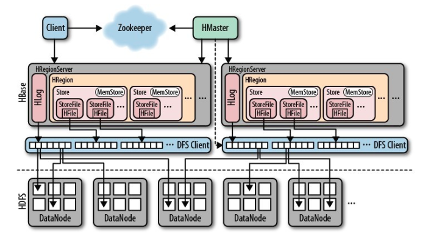
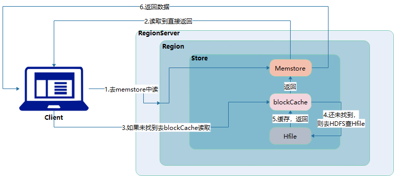
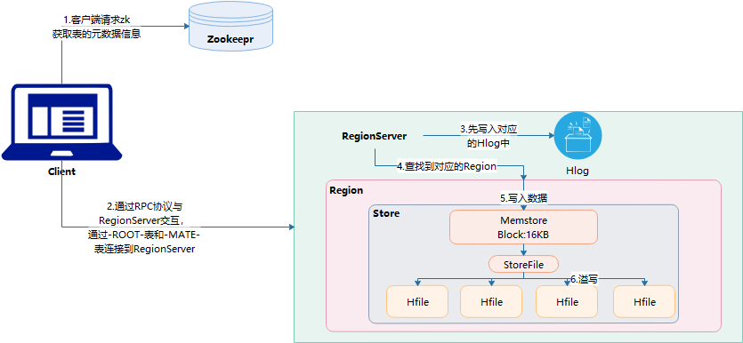
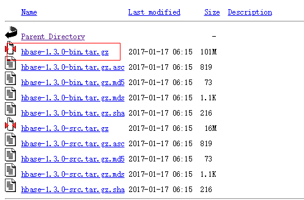
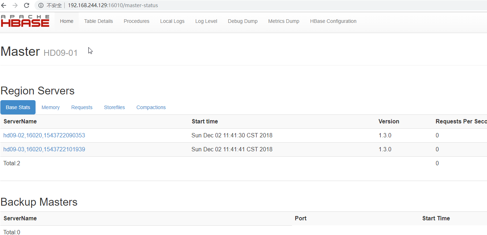
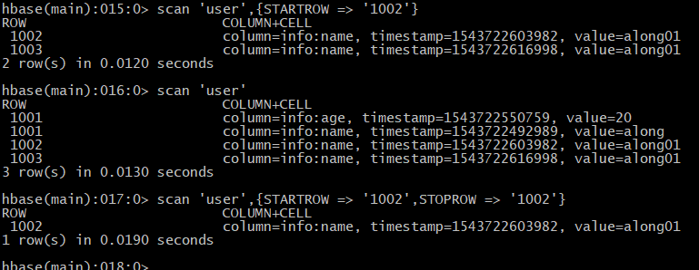
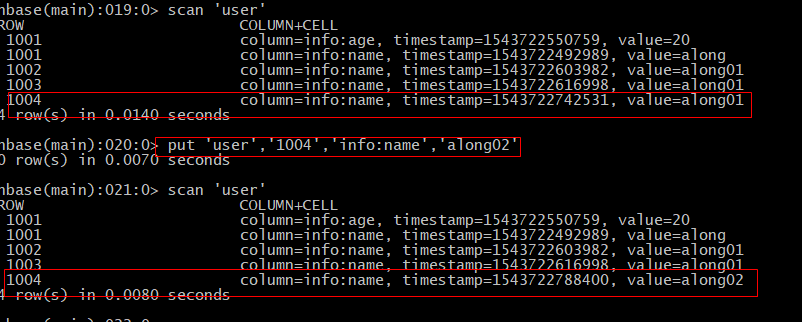
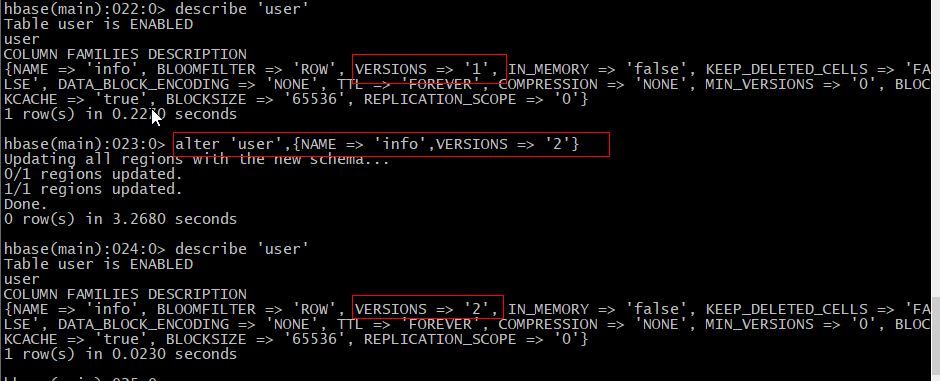
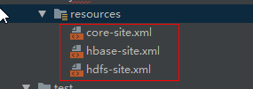
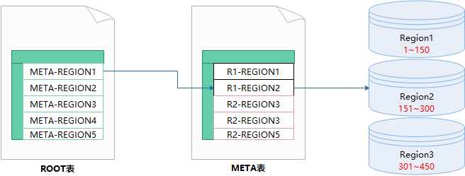

### Hbase概述
+ 官网：http://hbase.apache.org/
+ 简介：Apache HBase™是Hadoop数据库，`是一个分布式，可扩展的大数据存储`。当您需要对大数据进行随机，实时读/写访问时，
请使用Apache HBase™。该项目的目标是托管非常大的表 - `数十亿行X百万列` - 在商品硬件集群上。Apache HBase是一个开源的，
分布式的，`版本化的非关系数据库(NoSql)`，模仿Google的Bigtable： Chang等人的结构化数据分布式存储系统。
正如Bigtable利用Google文件系统提供的分布式数据存储一样，Apache HBase在Hadoop和HDFS之上提供类似Bigtable的功能。
+ 特点：
1. 线性和模块化可扩展性
2. 严格一致的读写操作
3. 表的自动和可配置分片
4. RegionServers之间的自动故障转移支持
5. 方便的基类，用于使用Apache HBase表支持的Hadoop MapReduce作业
6. 易于使用的Java API，用于客户端访问
7. 阻止缓存和布隆过滤器以进行实时查询
8. 查询谓词通过服务器端过滤器下推
9. Thrift网关和REST-ful Web服务，支持XML，Protobuf和二进制数据编码选项
10. 可扩展的基于jruby（JIRB）的外壳
11. 支持通过Hadoop指标子系统将指标导出到文件或Ganglia; 或通过JMX
+ 里程碑
1. 2006年-google发表了bigtable的白皮书
2. 2006年-开始开发hbase
3. 2008年-hbase开始成为apache的子项目
4. 2010年-正式成为apache的顶级项目
### 架构

1. Zookeeper：存储的数据元数据信息，Zookeepr维护HRegionServer的元数据
2. HRegionServer：数据存储的位置
3. HLog：欲写入日志，放到本地磁盘
4. HRegion：可以理解为一个表
5. Store：存储单元，较抽象，并不是数据的落脚点
6. MenStore：内存的区域
7. StorgeFile：本地磁盘中的一个文件
8. HFile：真正用于存储的文件
### 读写流程
+ 读流程
   
+ 读写分离

+ 写流程

### 安装部署
+ 下载：http://archive.apache.org/dist/hbase/     

+ 集群配置(前提)：zookeeper集群、Hadoop集群
+ 上传解压：tar -zxvf hbase-1.3.0-bin.tar.gz -C hd/
+ 修改配置文件1：vi hbase-env.sh              
查看JDK位置：echo $JAVA_HOME        
\# The java implementation to use.  Java 1.7+ required.      
export JAVA_HOME=/root/hd/jdk1.8.0_144      
\# Tell HBase whether it should manage it's own instance of Zookeeper or not.        
export HBASE_MANAGES_ZK=false
+ 修改配置文:2：vi hbase-site.xml   
```xml
<configuration>
<!--设置namenode所在位置 通过rootdir设置 也就是设置hdfs中存放的路径 -->
        <property>
                <name>hbase.rootdir</name>
                <value>hdfs://HD09-01:9000/hbase</value>
        </property>
        <!-- 是否开启集群-->
        <property>
                <name>hbase.cluster.distributed</name>
                <value>true</value>
        </property>
        <!-- 0.98版本后的新变动，之前的版本没有.port，默认端口为6000 -->
        <property>
                <name>hbase.master.port</name>
                <value>16000</value>
        </property>
        <!-- zookeeper集群位置 -->
        <property>
                <name>hbase.zookeeper.quorum</name>
                <value>HD09-01:2181,HD09-02:2181,HD09-03:2181</value>
        </property>
        <!-- hbase的元数据信息存储在zookeeper的位置 -->
        <property>
                <name>hbase.zookeeper.property.dataDir</name>
                <value>/root/hd/zookeeper/zkData</value>
        </property>
</configuration>
```  
+ 修改配置文件3： vi regionservers(增加集群的所有主机名称)
```
HD09-01
HD09-02
HD09-03
```
+ 解决版本依赖
    1. 删除lib下的hadoop和zookeeper      
    
    2. 把集群安装的hadoop和zookeeper放到hbase的lib中
       拷贝   
       E:\hadoop-2.8.5\share\hadoop\hdfs    
       E:\hadoop-2.8.5\share\hadoop\common  
       下面的hadoop-*.jar文件    
       拷贝E:\zookeeper-3.4.12\zookeeper-3.4.12.jar    
    3. 软连接到hdfs、hadoop,相当于快捷方式      
    [root@HD09-01 lib]# ln -s /root/hd/hadoop-2.8.5/etc/hadoop/core-site.xml /root/hd/hbase-1.3.0/conf/     
    [root@HD09-01 lib]# ln -s /root/hd/hadoop-2.8.5/etc/hadoop/hdfs-site.xml /root/hd/hbase-1.3.0/conf/
+ 拷贝到其他服务器：scp -r hbase-1.3.0/ HD09-02:$PWD
+ 集群启动(单节点启动)
    7. 启动hadoop：start-dfs.sh
    7. 启动zookeeper：zkServer.sh start
    7. 启动master：./hbase-daemon.sh start master
    7. 启动regionserver: ./hbase-daemon.sh start regionserver
    7. 启动客户端：bin/hbase shell
+ web网址：http://host_ip:16010/master-status      

### Hbase存储结构  
`Hbase是按列存储，传统数据库是按照行存储，因此Hbase的查询效率会更高 `        

### Shell命令
1. 查看服务器状态：status 'host_name'
2. 查看当前有哪些表：list
3. 查看帮助：help
4. 创建表： CREATE 'user','info'        
user--表名    
info-列族名
5. 查看表：SCAN 'user'      
rowkey--行键，唯一       
timestamp--时间戳，自动生成     
cell--单元格，数据存放的位置，自动生成      
column fanilly--列族，列族下包含多个列     
column --列
6. 根据条件查看表：SCAN table_name,{STARTROW => rowkey,STOPROW => rowkey}       

7. 给表加数据：PUT 'table_name','rowkey','列族名:列名','value'     
        
注：Hbase是按照列存储的，传统数据库按行存储，因此hbase的查询效率高
8. 覆盖数据：在hbase中，只要保证值不同，其他相同的put操作就是覆盖      

9. 查看表结构：describe '表名'      

10. 变更表结构：alter '表名',{NAME => 'info',VERSIONS => '3'}       

11. 删除：delete '表名','rowkey','列族:列'      

12. 清空表：truncate '表名'       

13. 删除表：
    1. disable '表名'    (先指定表不可用才能删除)
    2. drop '表名'    
    
14. 统计表中行数，统计的是rowkey数量：count '表名'      

15. 查看指定列的数据：get '表名','rowkey','列族:列名'      

### 常用API
1. 下载已安装好集群中的配置文件(如图几个)，并放到resource中        

2. 修改本地开发环境的主机映射(以Windos为例)     
文件路径：C:\Windows\System32\drivers\etc        
加入以下映射：集群服务器的[ip host_name]     

3. 代码编写
[完整代码](HbaseApi/src/main/java/HbaseAPI/HbaseTest.java)
### Hbase-MR操作
+ Hbase擅长存储数据，并不擅长计算分析数据，可以结合其他组件(mapreduce/spark)
#### 案例1(官方案例)：对一张表的rowkey进行计数
1. 查看使用mapreduce需要用到哪些依赖包：执行hbase mapredcp      

2. Hbase执行MR环境准备：
    1. 导入临时环境变量：    
    export HBASE_HOME=/root/hd/hbase-1.30/      
    export HADOOP_HOME=/root/hd/hadoop-2.8.4/
    2. 加载依赖包        
    export HADOOP_CLASSPATH=\`${HBASE_HOME}/bin/hbase mapredcp\`        
    `注意：这个是临时添加，如果永久使用，需要添加到hbase-env.sh`       
    
3. 执行官方的案例：     
cd hd/hbase-1.3.0/      
/root/hd/hadoop-2.8.4/bin/yarn jar lib/hbase-server-1.3.0.jar rowcounter user       

#### 案例2：把本地数据导入到Hbase中
> - 思路：Hbase底层存储的是hdfs，把数据线导入到hdfs，hbase对应创建一个表，利用mr导入数据到表中
1. 数据导入到hdfs中：
    2. hdfs dfs -mkdir /love_in
    2. hdfs dfs -put love.tsv /love_in      
    
2. Hbase创建表：hbase(main):001:0> create 'love','info'
3. /root/hd/hadoop-2.8.4/bin/yarn jar lib/hbase-server-1.3.0.jar \      
   -> importtsv \       
   -> -Dimporttsv.columns=HBASE_ROW_KEY,info:name,info:description \        
   -> love \        
   -> hdfs://HD09-01:9000/love_in/          
   
#### 案例3： 将hbase中love表进行指定列的筛选，然后导入到lovemr表中
+ 思路：
> 1. 构建Mapper类，读取love表中的数据    
> 2. 构建Reducer类，将love表中的数据写入到lovemr表中
> 3. 构建Diver驱动类
> 4. 打包 jar包，放入集群中运行这个任务
+ 实现
1. Mapper类：[ReadLoveMapper](HbaseApi/src/main/java/HbaseMR/ReadLoveMapper.java)
2. Reducer类：[WriteLoveReducer](HbaseApi/src/main/java/HbaseMR/WriteLoveReducer.java)
3. Driver类：[LoveDriver](HbaseApi/src/main/java/HbaseMR/LoveDriver.java)
4.  打包，上传，执行    
/root/hd/hadoop-2.8.4/bin/yarn jar HbaseTest-2.0.jar(包名) HbaseMR.LoveDriver(主类名)
5. 测试结果：        

#### 案例4：HDFS中的数据写入到Hbase
1. 构建Mapper类，来读取HDFS的数据:[ReadLoveFromHDFSMapper](HbaseApi/src/main/java/HbaseHDFS/ReadLoveFromHDFSMapper.java)
2. 构建Reducer类：[WriteLoveReducer](HbaseApi/src/main/java/HbaseHDFS/WriteLoveReducer.java)
3. 构建驱动类Driver：[LoveDriver](HbaseApi/src/main/java/HbaseHDFS/LoveDriver.java)
4. 打包，上传，执行    
   /root/hd/hadoop-2.8.4/bin/yarn jar HbaseTest-2.0.jar(包名) HbaseMR.LoveDriver(主类名)
### 优化方案
+ 真正存储数据的是region需要维护一个区间段的rowKey        

#### 预分区优化
+ 手动设置预分区      
`create 'user_p','info','partition',SPLITS => ['101','102','103','104'] `     
**注意：分区会比设置的多一个，因为是开区间，会有-∞ ~ +∞**      
第一个分区 (-∞ ~ 101]        
第二个分区(101 ~ 102]        
第三个分区(102 ~ 103]      
第四个分区(103 ~ 104]        
第五个分区(104 ~ +∞)     
      

+ 生成16进制序列预分区：
`create 'user_p_2','info','partition',{NUMREGIONS => 15,SPLITALGO => 'HexStringSplit'}`     

+ 按照文件设置的规则来设置预分区
    1. 创建文件，需要在Hbase的终端目录下，例如是在/root/下执行的hbase shell，则需要放到/root/下       
    splits.txt      
    
    2. create 'user_p3','info','partition',SPLITS_FILE => 'splits.txt'      
    
#### rowKey设计优化
一条数据的唯一标识是rowKey，`此rowKey存储在哪个分区取决于属于哪个预分区内，设计rowKey是为了防止数据倾斜，
数据均匀分配到每个rowKey中`
+ 生成随机数、hash数、散列值
+ 字符串反转，进行数据打散，尽可能随机       
例如：     
201812080011 反转 110080218102        
201812080012 反转 210080218102
+ 字符串拼接：       
例如：     
201812080011  -> 201812080011_asew      
201812080012  -> 201812080012_obad      
### 属性优化
+ 内存优化：     
一般分配70%的内存给hbase的java堆，不建议分配非常大的堆内存，一般内存设置为 16~48GB     
设置：hadoop-env.sh

+ 基础优化
    1. 优化DataNode的最大文件打开数       
    设置：hdfs-site.xml        
    属性：dfs.datanode.max.transfer.threads        
    默认：4096，设置大于4096        
    2. 优化延迟高的数据操作时间     
    设置：hdfs-site.xml        
    属性：dfs.image.transfer.timeout       
    默认：60000ms          
    优化点：调大      
    4. 数据的写入效率，压缩数据            
    属性：mapreduce.map.output.commpress       
    默认：jcp      
    可以设置：org.apache.hadoop.io.compress.GzipCodec等       
    5. 设置Hstore的文件大小        
    属性：hbase.hregion.max.filesize       
    默认值：10GB        
    优化点：调小      
