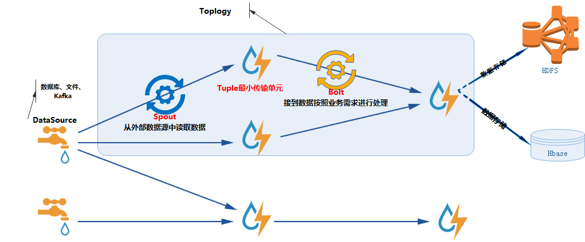
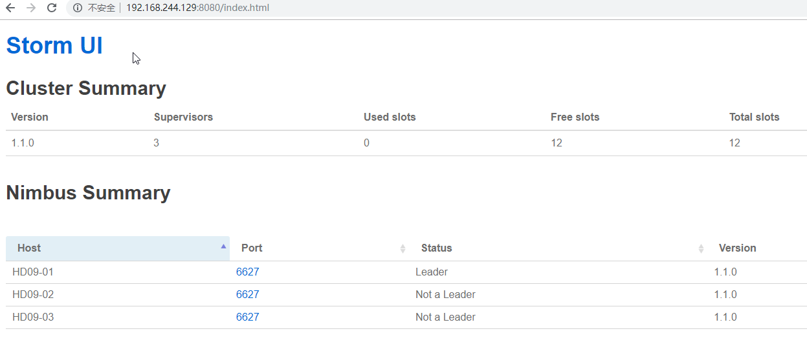
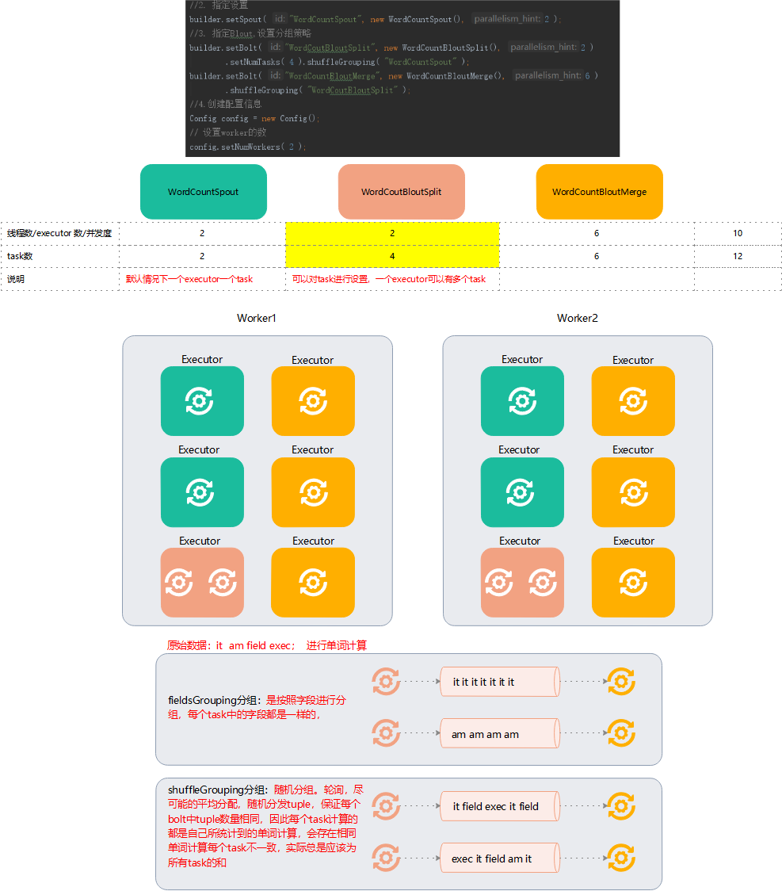
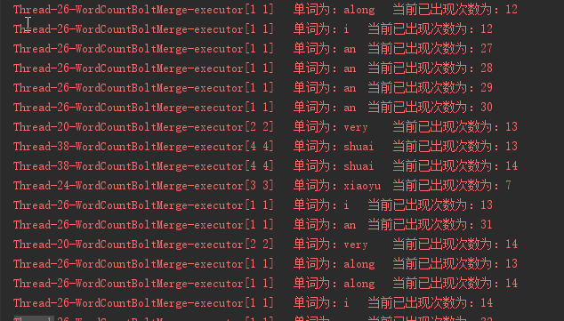

### 概述
+ 官网：http://storm.apache.org/
+ 简介：Apache Storm是一个免费的开源分布式`实时`计算系统。Storm可以轻松可靠地`处理无限数据流`，实现Hadoop对批处理所做的
实时处理。Storm非常简单，`可以与任何编程语言一起使用`，并且使用起来很有趣！Storm有许多用例：实时分析，在线机器学习，
连续计算，分布式RPC，ETL等。风暴很快：一个基准测试表示每个节点每秒处理超过一百万个元组。它具有可`扩展性，容错性`，
可确保您的数据得到处理，并且易于设置和操作。Storm集成了您已经使用的排队和数据库技术。Storm拓扑消耗数据流并以任意复杂
的方式处理这些流，然后在计算的每个阶段之间重新划分流。
+ 基本架构      

+ 实时对比离线计算
    + 离线计算
    > - 批量的获取数据、批量的传输数据、批量存储数据、周期性计算数据、数据可视化
    > 1. Flume批量获取数据
    > 2. Sqoop批量传输
    > 3. HDFS/Hive/Hbase批量存储
    > 4. MR/Hive计算
    > 5. BI，报表工具
    + 实时计算
    > - 数据实时产生、数据实时传输、数据实时计算、实时的可视化
    > 1. Flume实时获取数据
    > 2. Kafka实时数据存储
    > 3. Storm/JStorm实时计算
    > 4. dataV/quickBI实时展示
### Storm对比Hadoop
|类型|Hadoop|Storm|Desc|
|---|---|---|---|
|-|JobTracker|Nimbus|班长|
|角色|TaskTracker|Supervisor|组长|
|-|Child|Worker|学生|
|应用名称|Job|Topology|任务名称|
|编程接口|Mapper/reducer|Spout/Bolt|-|
### Storm编程模型
+ Tuple：元祖
> - 是消息的基本单元
+ Spout：水龙头；相当于Mapper
> - Storm的核心抽象。拓扑的流的来源。通常是从外部数据源读取数据，转换成拓扑内部的源数据。
	* 
+ 主要方法：
    1. nextTuple()  -> 发出一个新的元祖到拓扑
	2. ack() -> 
	3. fail -> 
+ Bolt：相当于转接头，相当于Reducer
> - 对是流的处理节点。是真正处理数据的组件
        
    作用：
    1. 过滤
    2. 业务逻辑处理
    3. 连接运算 -> 处理完后可以继续交给笑一个Bolt再进行处理
+ Topology:拓扑，相当于MapReducer的Job
> - 是一个实时应用的程序

特点：只要开始运行，就会永远运行，除非被kill
Spout到Bolt是一个连接流
### 安装部署
+ 准备工作：需要安装zookeeper集群
+ 下载、上传、解压     
[root@log1 local]# wget http://apache.fayea.com/storm/apache-storm-1.1.0/apache-storm-1.1.0.tar.gz      
[root@log1 local]# tar zxf apache-storm-1.1.0.tar.gz -C hd/
+ 修改配置文件   vi /root/hd/storm/conf/storm.yaml
```
#设置zookeeper的主机名称
storm.zookeeper.servers:
- "Hadoop01"
- "Hadoop02"
- "Hadoop03"
#设置storm的数据存储路径
storm.local.dir: "/root/hd/storm/data"
# 用于配置主控节点的地址，可以配置多个。
nimbus.seeds: ["Hadoop01"]
#设置workers的端口号
supervisor.slots.ports:
- 6700
- 6701
- 6702
- 6703
```
+ 修改环境变量
```
####################storm############# 
export STORM_HOME=/root/hd/storm
export PATH=$PATH:$STORM_HOME/bin
```
+ 分发到其他节点
```
scp -r storm/ Hadoop03:$PWD
scp profile Hadoop03:$PWD
```
+ 加载环境变量：source /etc/profile
+ 启动nimbus：storm nimbus &  #后台启动nimbus,节点都需要启动
+ 启动supervisor：storm supervisor & #后台启动supervisor，节点都需要启动
+ 启动UI界面：storm ui
> - 网址：http://host_ip:8080      


### 常用命令
1. 查看帮助     
storm help
1. 查看版本     
storm version
1. 查看当前正在运行的拓扑及其状态      
storm list
1. 提交jar任务      
storm jar [**.jar] [全类名] [拓扑名]
1. 杀死守护进程       
storm kill [拓扑名]        
1. 禁止拓扑程序       
strom deactivate [拓扑名]
1. 激活拓扑程序       
strom activate [拓扑名]
### 核心组件

### 分组策略
1. Fields Grouping      
按照字段分组。相同字段发送到一个task中
1. shuffle Grouping     
随机分组。轮询，尽可能的平均分配，随机分发tuple，保证每个bolt中tuple数量相同
1. Non Grouping     
不分组。采用这种策略每个Blot接收的单词不同
1. All Grouping     
广播发送
1. Global Grouping      
全局分组，分配给task id值最小的，根据线程id判断，只分配给线程id最小的

### 案例1：WordCount
1. 自定义Spout，接收数据。[WordCountSpout](StromCase/src/main/java/WordCount/WordCountSpout.java)
2. 自定义一个Bolt，用于切分数据，并传给下一个Blot。[WordCountBoltSplit](StromCase/src/main/java/WordCount/WordCountBoltSplit.java)
3. 自定义一个Bolt，用于统计单词个数。[WordCountBoltMerge](StromCase/src/main/java/WordCount/WordCountBoltMerge.java)
4. 自定义驱动类，进行本地任务提交。[WordCountDriver](StromCase/src/main/java/WordCount/WordCountDriver.java)
+ 测试：       

### 案例2：网站PV统计
+ 访问网站日志数据格式        

+ 思路
1. 自定义一个Spout，用于读取本地日志数据，一行一行的传输给下一个组件Bolt。[PvCountSpout](StromCase/src/main/java/PVCount/PvCountSpout.java)
2. 自定义一个Bolt，用于切分数据、并进行局部汇总，传输给下一个Bolt。[PvCountSplitBolt](StromCase/src/main/java/PVCount/PvCountSplitBolt.java)
3. 自定义一个Bolt，用于接收上一个组件数据，并进行汇总。[PvCountBolt](StromCase/src/main/java/PVCount/PvCountBolt.java)
4. 自定义驱动类，进行本地任务提交。[PvCountDriver](StromCase/src/main/java/PVCount/PvCountDriver.java)
+ 测试：       

