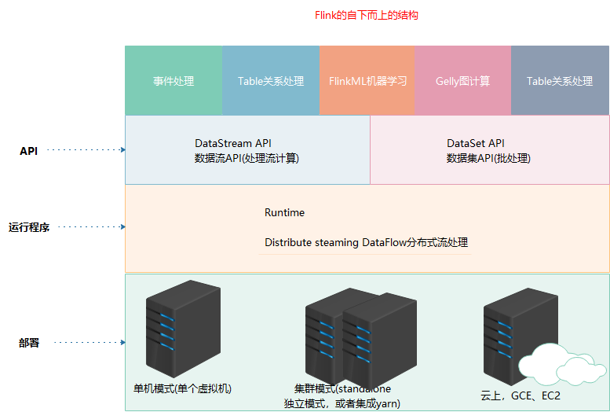
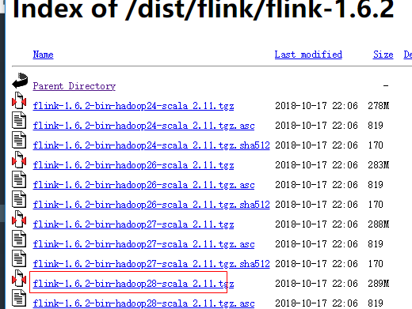
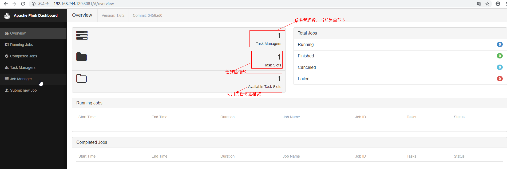
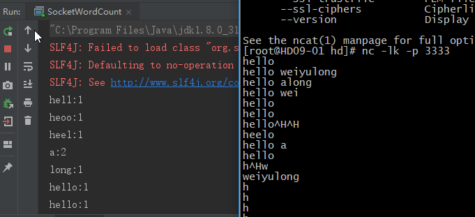
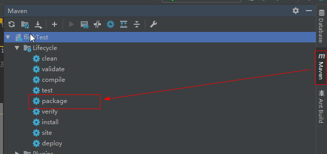
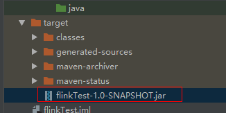

### 概述
+ 官网：https://flink.apache.org/
+ 简介：Apache Flink是一个框架和分布式处理引擎，用于对`无界和有界`数据流进行有状态计算。Flink设计为在所有常见的集群环境中
运行，以内存速度和任何规模执行计算。
### 特点
1. 随处部署应用，可以与其他组件集成
    1. Flink是分布式系统，需要计算资源才可以执行程序。Flink可以与常见的集群资源管理器进行集成(Haddoop Yarn，Apach Mesos)
    2. Flink可以单独作为独立的集群模式运行
    3. 可以通过不同的部署模式实现，这些模式允许Flink以惯有的方式进行交互
    4. **当我们部署Flink程序时，Flink会根据应用程序配置的并行读自动识别所需资源**
        1. 例如我们有20G的空间，我们只需要5G的资源，只会使用5G，另外的15G不会使用
        2. 需要多少资源，会从资源管理器中请求资源
    5. 容错机制
        1. 如果发生故障，Flink会请求信的资源来替换发生故障的容器
    6. **提交或控制程序都通过REST调用进行，简化Flink在环境中的集成**
2. 以任何比例应用程序
    1. 可以小集群、也可以无限集群
    2. Flink旨在以任何规模的运行有状态的应用程序。**应用程序可以并行化在集群中分布和同时执行程序，因此，
    我们的应用集群可以利用无限的CPU和磁盘与网络IO**
    3. Flink可以轻松的维护非常大的应用程序状态
    4. 用户可拓展性报告
        1. 应用程序每天可以处理万亿个事件
        2. 应用程序每天可以未付多个TB的状态
        3. 应用程序可以在数千个内核中运行
3. 充分的利用集群中的性能
   1. 有状态Flink应用程序针对于本地状态访问进行了优化。**任务状态始终的保存在内存中，或者如果大小超过了可用内存，
   Flink会保存在高效磁盘数据结构中(SSD)**，任务可以通过访问本地来执行所有的计算，从而产生极小的延迟，
   Flink定期并且异步的检查本地状态持久存储来保证出现故障时一次状态的一致性       
   
### 有界无界
+ 无界：有开始无结束，处理实时数据
+ 有界：有开始有结束，处理离线数据      

### 运行模型
+ 流计算
> - 数据源源不断的产生，我们的需求是源源不断的处理。程序需要一直保持在计算的状态
+ 批处理
> - 计算一段完整的数据集，计算陈宫后释放资源，name此时的工作结束
### 使用场景
1. 处理结果准确：无论是有序数据还是延迟达到的数据
2. 容错机制：有状态：保持每次的记过往下传递，实现累加。DAG(有向无环图)
3. 有很强大的吞吐量和低延迟：计算速度快，吞吐量处理的量级大
4.  能够精准的维护应用状态：Storm:会发生要么多计算一次，要么漏计算
5. 支持大规模的计算：可以运行在数前台节点上
6. 支持流处理和窗口化操作
7. 版本化处理：对当前处理的数据可以设置一个版本号
8. Flink可以通过检查点机制实现精准的一次性计算保证：计算过程中出现问题，不用再次计算已经计算的部分
9. 支持Yarn与mesos资源管理器
### 架构
     

### 安装部署
##### 单机版安装
1. 下载：https://flink.apache.org/downloads.html       

2. 上传到一个节点并解压： tar -zxvf flink-1.6.2-bin-hadoop28-scala_2.11.tgz -C hd/
3. 启动：**bin/start-cluster.sh**      

4. 访问ui界面：http://host_ip:8081       

##### 集群版安装(已经安装好单机版情况下)
1. 配置主节点：vi /root/hd/flink-1.6.2/conf/flink-conf.yaml        
修改：jobmanager.rpc.address:Hadoop01(主节点host_name)
2. 添加从节点：vi /root/hd/flink-1.6.2/conf/slaves        
一行一个其他节点的host_name      

3. 发送到从节点：scp -r flink-1.6.2/ Hadoop02(从节点host_name):$PWD
4. 修改环境变量并发送：vi /etc/profile  增加如下内容     
##############Flink#################        
export FLINK_HOME=/root/hd/flink-1.6.2      
export PATH=$PATH:$FLINK_HOME/bin       
5. 发送环境变量，重写加载环境变量      
scp profile HD09-02:$PWD        
source /etc/profile
6. 启动集群     

### 案例-单词统计
+ [代码](WordCountFlink/src/main/java/WordCount/SocketWordCount.java)
+ 本地测试
    1. 安装nc(瑞士军刀)：yum install nc
    2. 打开代码指定端口：nc -lk -p 3333
    3. 运行结果     
    
+ 集群测试
    1. 代码打包     
            
    
    2. 上传到集群，并运行：flink run -c WordCount.SocketWordCount /root/flinkTest-1.0-SNAPSHOT.jar
    3. 运行结果     
    
